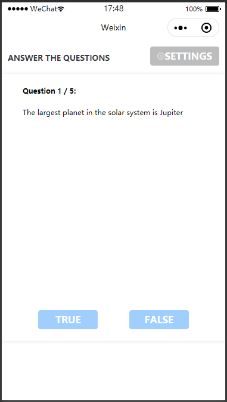
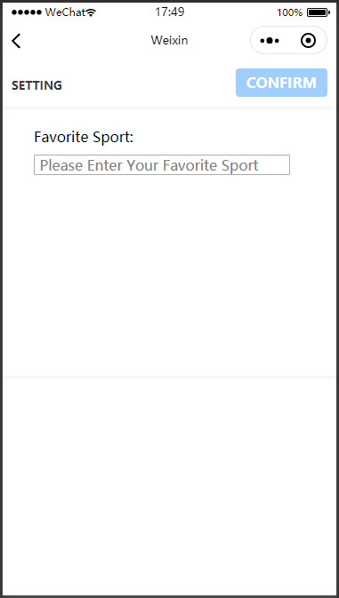

# Analytics Kit Demo for WeChat Mini-Programs

## Contents

* [Introduction](#Introduction)
* [Getting Started](#Getting-Started)
* [Installation](#Installation)
* [Configuration](#Configuration)
* [Environment Requirements](#Environment-Requirements)
* [Operation Result](#Operation-Result)
* [License](#License)

## Introduction
HmsAnalyticsKitDemo provides an example of integrating Analytics Kit into a WeChat mini-program. It illustrates how to collect predefined events and custom events to improve user engagement and user preference.
[Learn more about Analytics Kit](https://developer.huawei.com/consumer/en/doc/development/HMSCore-Guides/introduction-0000001050745149).

## Getting Started

For details, please refer to the links below:

[Development Guide](https://developer.huawei.com/consumer/en/doc/development/HMSCore-Guides/introduction-0000001050745149)

[API Reference](https://developer.huawei.com/consumer/en/doc/development/HMSCore-References/overview-0000001077819400)

HmsAnalyticsKitDemo is used as an example to describe how to use the Analytics SDK for WeChat mini-programs.

First, download HmsAnalyticsKitDemo by cloning this repository or downloading the compressed package. 

In the WeChat DevTools, click **Import Project** and select **HmsAnalyticsKitDemo**.

You can click **Compile** to run the project.

Create an app in AppGallery Connect, obtain the **agconnect-services.json** file, and assign the JSON data in it to the **agconnectConfig** variable in the **HiAnalyticsConfig.js** file. Click [here](https://developer.huawei.com/consumer/en/doc/development/HMSCore-Guides/introduction-0000001050745149) to learn more.

## Installation
1. Use the WeChat DevTools to open the decompressed project. Two demos are provided:
    1. **miniprogram.hmsanalyticskitdemo**: demo that has integrated the SDK.
    2. **miniprogram.hmsanalyticskitdemo-start**: demo that has not integrated the SDK. You can use this demo to learn how to integrate the SDK.
2. Enable the npm function. Click [here](https://developers.weixin.qq.com/miniprogram/en/dev/devtools/npm.html) to view the details.
3. Run the following command to install the dependency:
    ```bash
    npm install --save @hw-hmscore/analytics-sdk-miniprogram
    ```
4. Go to **Tools** > **Build npm** to build the dependency of the npm library.

## Configuration
1. Create an app in AppGallery Connect and obtain the app configuration file **agconnect-services.json**. In the WeChat DevTools, assign the JSON data in the **agconnect-services.json** file to the **agconnectConfig** variable in the **HiAnalyticsConfig.js** file.

## Environment Requirements
Hardware:
1. A computer (desktop or laptop)
2. A test phone with WeChat installed, used for previewing and debugging the mini-program
  
Software:
1. Analytics Kit 6.3.0
2. WeChat DevTools
3. Node.js

## Operation Result
After running the app, you will see the following screen.



Tap **TRUE** or **FALSE** to answer the question; tap **NEXT** to go to the next question; tap **POST SCORE** to record the obtained score. All information will be uploaded to the console of Analytics Kit. You can use DebugView to view the information in real time.

Tap **SETTINGS**, and you will see the following screen.



On the screen displayed, you can set your favorite sport. Your configuration will be recorded in the Analytics SDK as a user attribute.

## License
HmsAnalyticsKitDemo is licensed under [Apache 2.0](http://www.apache.org/licenses/LICENSE-2.0).
